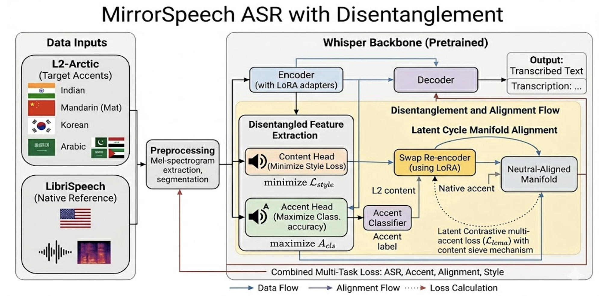

 # MirrorSpeech                                                                
  ### Latent Cycle Manifold Alignment for Unseen-Accent Robust ASR              
                                                                                
  > Strip the accent. Keep the meaning. Make ASR fair.                          
                                                                                
  **WER: 26.0% → 11.5% — 55.8% relative improvement**                           
  Trained in 3 epochs on a single GPU, touching less than 1% of Whisper's       
  parameters.                                                                   
                  
  ---

  ## Overview                                                                   
   
  MirrorSpeech is an accent-robust Automatic Speech Recognition (ASR) system    
  built on top of OpenAI's Whisper-small. It addresses a fundamental gap in
  modern ASR: systematic underperformance on non-native, accented English       
  speech.                                                                       
                                                                                
                                                                                 
  The core idea is disentanglement — teaching the model to explicitly separate:
  - **Content** — *what* is being said                                         
  - **Accent** — *how* it is being said
                                       
  This separation is enforced through **Latent Cycle Manifold Alignment (LCMA)**,
  a cycle-consistency loss that structurally prevents accent information from    
  leaking into the content representation — without requiring accent labels at
  inference time.                                                             
                 
  ---
     
  ## Problem
            
  Whisper-small in zero-shot mode on the L2-ARCTIC test set (n = 1,855):
                                                                        
  | Metric | Score |
  |--------|-------|
  | Overall WER | 26.0% |
  | Overall CER | 18.2% |
  | Arabic WER | 109.2% |
  | Native WER | 4.6% |  
                       
  Non-native speakers face word error rates 2–3x higher than native speakers.
  Whisper was trained on 680k hours of predominantly native English audio and
  has no mechanism to separate linguistic content from speaker accent. Full  
  fine-tuning across 244M parameters per accent is computationally prohibitive
  and risks catastrophic forgetting.                                          
                                    
  ---
     
  ## Our Approach
                 
  ### 1. Frozen Whisper + LoRA
  We inject low-rank adapter matrices into Whisper's attention layers, training
  fewer than 1% of total parameters. This preserves Whisper's pretrained       
  knowledge while enabling efficient accent-specific adaptation — no catastrophic
  forgetting, fast to train.                                                     
                            
  ### 2. Content / Accent Disentanglement
  Two lightweight heads operate on Whisper's encoder output:
  - **Content Head** — captures what was said, trained to be accent-invariant
  - **Accent Head** — captures speaker style and accent characteristics      
                                                                       
  ### 3. LCMA — The Heart of MirrorSpeech
                                         
  **Mirror Test:**
  Strip the accent by replacing it with a neutral zero vector. Concatenate with
  the unchanged content and re-run through Whisper. If the encoder is truly    
  disentangled, the content survives — the speech looks the same in the mirror
  even after the accent is removed.                                           
                                   
  **Cycle-Consistency Loss:**
  L_LCMA = β · MSE(content, content')
  Penalises any drift between the original and re-encoded content representation.
  Backpropagation pushes accent information out of the content stream —                                                                                                                                   
  guaranteeing disentanglement holds throughout training.                                                                                                                                                 
                                                                                                                                                                                                          
  ---                                                                                                                                                                                                     
                                                                                                                                                                                                          
  ## Architecture 
                 
  ## MirrorSpeech ASR with Disentanglement

---

## MirrorSpeech — Total Loss Flow

                                                                                                                                                                         
  ## Dataset      

  **L2-ARCTIC** — Non-native accented English speech                                                                                                                                                      
   
  | Accent | Speakers |                                                                                                                                                                                   
  |--------|----------|
  | Indian | RRBI, SVBI, TNI, NJS |                                                                                                                                                                       
  | Mandarin | HQTV, MBMPS, NCC, TXHC |                                                                                                                                                                   
  | Korean | HJK, HKK, YDCK, YKWK |                                                                                                                                                                       
  | Arabic | ABA, YBAA, SKA, ZHAA |                                                                                                                                                                       
                                                                                                                                                                                                          
  24 speakers · 4 accents · ~18,000 WAV files                                                                                                                                                             
  Source: https://psi.engr.tamu.edu/l2-arctic-corpus/                                                                                                                                                     
                                                                                                                                                                                                          
  **LibriSpeech** — Native American English from audiobooks                                                                                                                                               
  Capped to balance classes. Used as the neutral accent reference for the LCMA                                                                                                                            
  swap step.                                                                                                                                                                                              
  Source: https://www.openslr.org/12
                                                                                                                                                                                                          
  **Audio Preprocessing Pipeline:**                                                                                                                                                                       
  1. Load WAV at original sample rate
  2. Resample → 16,000 Hz                                                                                                                                                                                 
  3. Log-Mel Spectrogram (n_fft=400, hop=160, n_mels=80) → [80 × T]                                                                                                                                       
  4. Normalize per spectrogram (mean=0, std=1)                                                                                                                                                            
  5. DataLoader yields `(spectrogram, transcript)`                                                                                                                                                        
                                                                                                                                                                                                          
  **Data split:** 80% train / 10% val / 10% test — split before preprocessing,                                                                                                                            
  zero data leakage.                                                                                                                                                                                      
                                                                                                                                                                                                          
  ---             
                                                                                                                                                                                                          
  ## Results      

  | Metric | Baseline (Whisper zero-shot) | MirrorSpeech |
  |--------|------------------------------|--------------|
  | Overall WER | 26.0% | **11.5%** |                                                                                                                                                                     
  | Overall CER | 18.2% | — |
  | Arabic WER | 109.2% | **~11%** |                                                                                                                                                                      
  | Korean WER (relative) | — | **↓ 21%** |                                                                                                                                                               
  | Native WER | 4.6% | no regression |                                                                                                                                                                   
  | Trainable Parameters | 100% | **< 1%** |                                                                                                                                                              
  | Training | — | 3 epochs, single GPU |                                                                                                                                                                 
                  
  **55.8% relative improvement in overall WER.**                                                                                                                                                          
                  
  ### Demo Examples                                                                                                                                                                                       
                  
  **Arabic** — `ABA_13.wav`                                                                                                                                                                               
  Reference:    at sea tuesday march seventeenth nineteen o eight
  Baseline:     at sea Tuesday March 17 1908               WER: 50.0%                                                                                                                                     
  MirrorSpeech: at sea tuesday march seventeen nineteen o eight  WER: 12.5%
                                                                                                                                                                                                          
  **Indian** — `NJS_4.wav`                                                                                                                                                                                
  Reference:    massage under tension was the cryptic reply
  Baseline:     Message and retention was a cryptic reply   WER: 57.1%                                                                                                                                    
  MirrorSpeech: massage and retention was a cryptic reply   WER: 42.9%
                                                                                                                                                                                                          
  **Korean** — `HKK_10.wav`                                                                                                                                                                               
  Reference:    her achievements with cocoanuts were a revelation
  Baseline:     her achievement with coconuts for a revelation   WER: 42.9%                                                                                                                               
  MirrorSpeech: her achievement with coconuts were a revelation  WER: 28.6%
                                                                                                                                                                                                          
  ---
                                                                                                                                                                                                          
  ## Demo         

  Open the demo notebook in Google Colab:                                                                                                                                                                 
   
  Phase2_Task8_colab_demo_mirrorspeech_V4.ipynb                                                                                                                                                           
                  
  Includes:                                                                                                                                                                                               
  - Real L2-ARCTIC audio clips across all 4 accents
  - Ground truth transcripts                                                                                                                                                                              
  - Side-by-side Baseline vs MirrorSpeech predictions
  - Per-clip WER delta                                                                                                                                                                                    
                  
  ---                                                                                                                                                                                                     
                  
  ## Reproducibility

  - Shared train/val/test splits
  - Fixed random seeds throughout
  - Full metric suite: WER / CER / PER / WIL / BERT F1                                                                                                                                                    
  - Open-source backbone (Whisper-small via Hugging Face)
                                                                                                                                                                                                          
  ---             
                                                                                                                                                                                                          
  ## Future Scope 

  | # | Direction |
  |---|-----------|
  | 01 | Run full ablations — no-swap, no-LCMA, full — to isolate each contribution |
  | 02 | Evaluate on EdAcc — test on accents the model has never seen |                                                                                                                                   
  | 03 | Learnable accent embeddings — replace neutral zero-vector with target-accent vectors |                                                                                                           
  | 04 | Scale up — Whisper-medium + larger LoRA, deploy as real-time streaming service |                                                                                                                 
                                                                                                                                                                                                          
  ---             
                                                                                                                                                                                                          
  ## Team — Group 4, SJSU Deep Learning                                                                                                                                                                   
   
  | Name |                                                                                                                                                                                                
  |------|        
  | Shreya Akotiya |
  | Vidushi Verma |
  | Mamta Jha |
  | Shristi Kumar |

